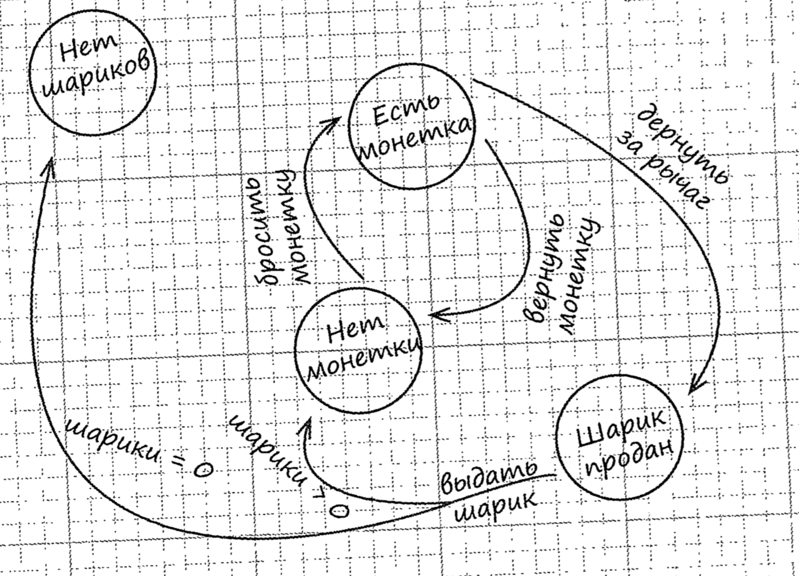

## Проблема

Необходимо разработать автомат для выдачи шариков жевательной резинки и в нем есть игра что каждый 10 получает два шарика вместо одного

Логика автомата:

## Паттерн Состояние
Управляет изменениями поведения объекта при изменении его внутреннего состояния. Внешне это выглядит примерно так, словно объект меняет свой класс.